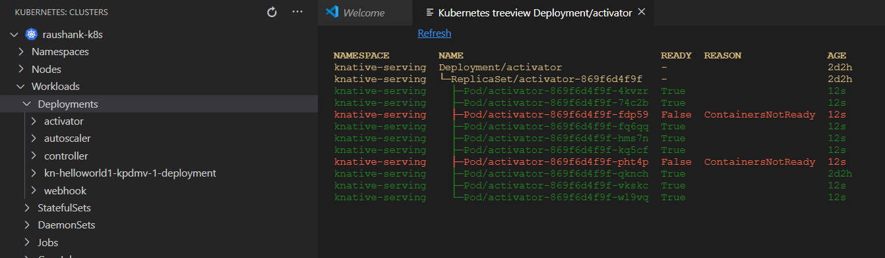
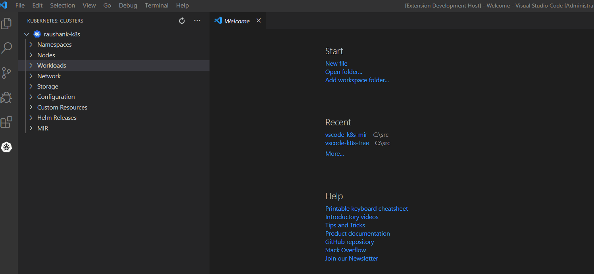

# vscode-k8s-tree README

This extension internally uses the [kubectl-tree](https://github.com/ahmetb/kubectl-tree) and add `Tree View` command to all kubernetes resource. This commands gives a hierarchy view of kubernetes resources based on `OwnerReferences`

## Features

* The tree view automatically gets updated every 5 seconds for the next 10 minutes.  
* You can also use the `Refresh` link on the page or use shortcut `shift+ctrl+r` to force refresh.  

## Dependencies

- [VSCode Kubernetes Tools v1.0.0 or higher](https://github.com/Azure/vscode-kubernetes-tools/releases/tag/1.0.0) and [it's dependencies](https://github.com/Azure/vscode-kubernetes-tools#dependencies), installed and [configured](https://github.com/Azure/vscode-kubernetes-tools#extension-settings).

## Requirements
Before using the extension makes sure you installed `kubectl-tree`  
Run `kubectl krew install tree` [Details](https://github.com/ahmetb/kubectl-tree)

## Build

`npm install`   
`npm run vscode:prepublish`

## Publish package

`vsce package` Generate vsix file
`vsce login raushan2016`  
`vsce publish minor` Publish the package with minor version upgrade

## Author

Raushan Kumar [@raushank2016](https://twitter.com/raushank2016).

**Special acknowledgement:** This tool internally uses [kubectl-tree](https://github.com/ahmetb/kubectl-tree)
